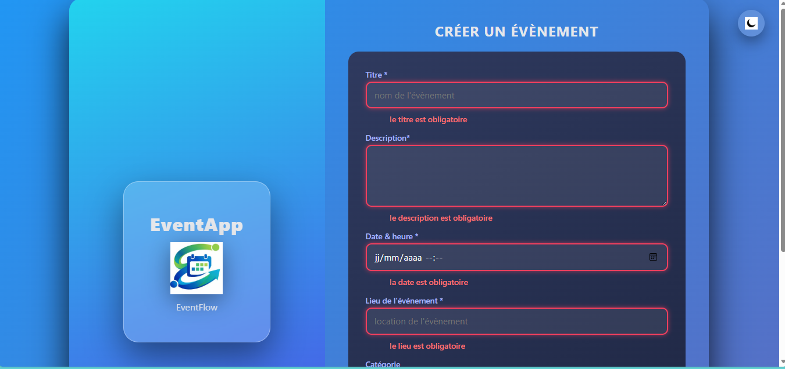
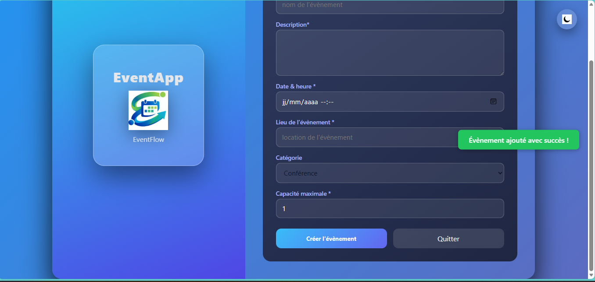
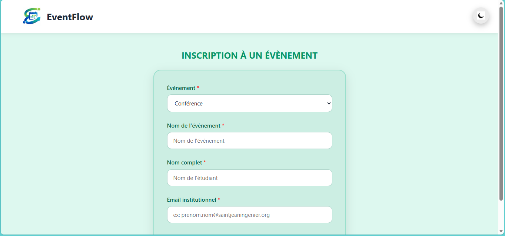
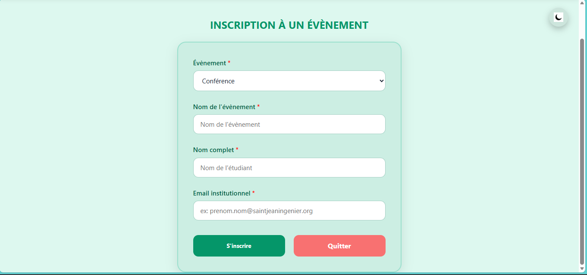
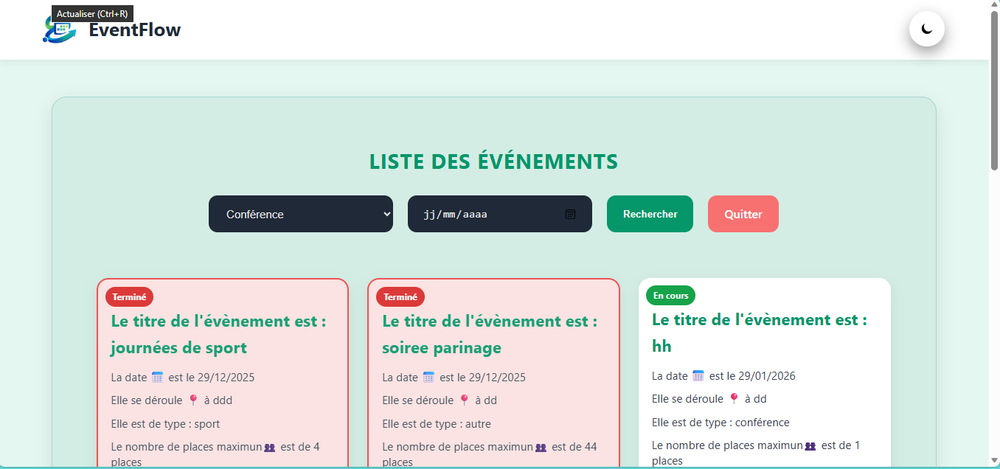
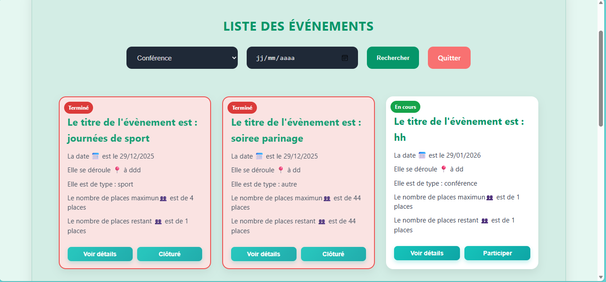
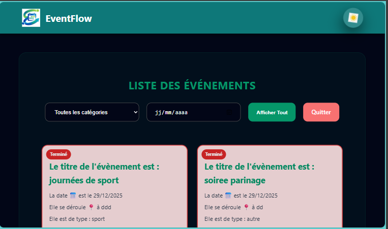
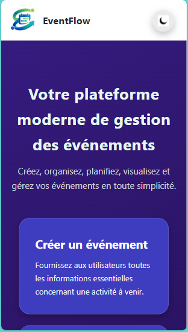
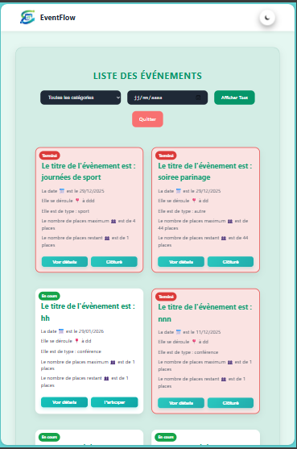

# EventFlow – Application de gestion des événements

## 1. Présentation du projet

**EventFlow** est une application web de gestion des événements développée en **TypeScript**, **HTML** et **CSS**.  
Elle permet de créer, consulter et gérer des événements ainsi que d’inscrire des utilisateurs de manière simple et intuitive.

Le nom **EventFlow** reflète l’objectif principal de l’application :
- **Event** : les événements à organiser  
- **Flow** : la fluidité et la bonne organisation des actions  

Ce projet a été réalisé dans le cadre académique de la **Licence 2 Informatique**.

---

## 2. Fonctionnalités développées

| Fonctionnalité       | Statut |
|----------------      |--------|
| Création d’événements =  OK |
| Affichage de la liste complète =  OK |
| Filtrage par catégorie =  OK |
| Page détail d’un événement = OK |
| Inscription d’un utilisateur = OK |
| Vérification des doublons = OK |
| Gestion capacité & places restantes = OK |
| Mode sombre = Bonus = OK |
| Responsive (mobile & tablette) = Bonus = OK |

## 3. Structure du projet

event-app/
│── index.html
│── styles/
│   └── gestion.css
│── images/
│── dist/              ← fichiers JavaScript compilés
│── src/
│   ├── models/        ← événement, utilisateur, inscription
│   ├── services/      ← logique métier
│   └── main.ts        ← point d’entrée
│── tsconfig.json
│── package.json
│── .gitignore
└── README.md
Description

src/ : code source TypeScript

dist/ : fichiers compilés

styles/ : feuilles de style CSS

images/ : captures d’écran

index.html : page principale de l’application

## 4. Installation & lancement
Prérequis

Node.js (v18 ou plus)

npm

Navigateur web moderne

Étapes

1️ Cloner le dépôt

git clone https://github.com/marsouelDev/EventFlow

2️ Accéder au projet

cd Event-app

3️ Installer les dépendances

npm install

4️ Compiler le TypeScript

npm run build

5️ Compilation automatique

npm run watch

6️ Lancer l’application
→ Ouvrir index.html dans un navigateur
→ ou utiliser Live Server (VS Code)

## 5  Mode d’utilisation de l’application
 Page d’accueil

Accès à :

Création d’événement

Inscription à un événement

Liste des événements

 Créer un événement

Remplir tous les champs obligatoires

Des messages d’erreur s’affichent si les données sont invalides

Un message confirme la création

 S’inscrire à un événement

Sélectionner un événement

Inscription impossible si :

l’événement est terminé

la capacité est atteinte

l’utilisateur est déjà inscrit

 Liste et filtres

Filtrage par catégorie et date

Les événements terminés sont affichés en rouge

Bouton Participer pour accéder à l’inscription

 Thème

Bascule mode clair / mode sombre

Application responsive (mobile & tablette)

. Captures d’écran
Page d’accueil

  

Formulaire de création d’événement

   

Erreurs de formulaire

  

Message de confirmation

  

Inscription à un événement

   

Liste des événements

   

Mode sombre

  

Responsive (mobile & tablette)

   

## 7. Conclusion & limites

L’application EventFlow répond efficacement aux objectifs de gestion des événements.
La validation des données, la gestion des capacités et l’inscription fonctionnent correctement.

Les principales difficultés concernaient la gestion des erreurs et la cohérence des données.
Avec plus de temps, des améliorations possibles seraient :

l’utilisation d’une base de données,

l’ajout d’une authentification,

une interface encore plus avancée.

## 8.  Informations auteur

Nom et Prénom	NGOUADJIO FEUDJIO Marsouel
Matricule	2425L111
Niveau	Licence 2 Informatique
Année	2025 – 2026