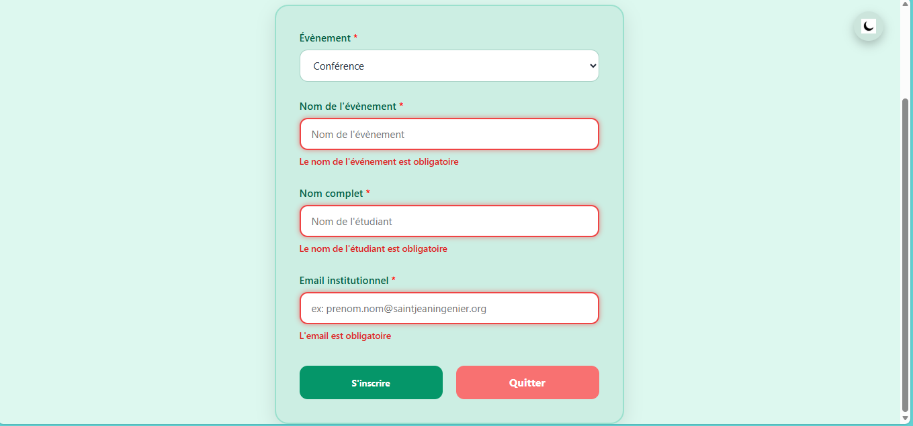

# EventFlow

EventFlow est une application web de gestion des événements. Elle facilite la création, la gestion, la consultation et l’inscription à des événements.

Le nom **EventFlow** a été choisi pour refléter l’objectif principal de l’application : faciliter la gestion fluide et organisée des événements.  
- **Event** désigne les événements à organiser.  
- **Flow** exprime l’idée de fluidité et de bonne organisation.

## Présentation de l’application

  

La page d’accueil propose trois boutons permettant d’accéder à :  
- Le formulaire d’inscription à un événement  
- Le formulaire d’inscription d’un utilisateur  
- L’affichage des événements existants  

---

### 1.Formulaire de création d’un événement

  
  

Ce formulaire permet d’enregistrer un événement avec les informations suivantes :  
- Titre  
- Description  
- Date  
- Lieu  
- Catégorie  
- Capacité

Si certains champs sont vides ou invalides, des messages d’erreur apparaissent pour guider l’utilisateur.

  

Une fois l’événement enregistré avec succès, un message de confirmation s’affiche.

  

---

### Formulaire d’inscription à un événement

  
  

Ce formulaire permet à un utilisateur de s’inscrire à un événement existant.

Des messages d’erreur s’affichent en cas de problème lors de la saisie, notamment :  
- L’événement sélectionné n’existe pas  
- Le nombre de places disponibles est plein  
- L’événement est terminé  

  

Lorsqu’une inscription réussit, un message de succès s’affiche pour confirmer l’inscription.

### Liste des événements

  

Les événements terminés sont signalés par un cadre rouge clair avec la mention **Terminé** affichée en haut du cadre.  
Les événements en cours restent dans un cadre blanc avec la mention **En cours**.

  

### Fonctionnalités additionnelles

- Filtrage des événements par catégorie et par date  
- Peut mettre  entre le mode clair et le mode sombre pour un meilleur confort visuel comme representer comme suit :

  

- Elle egalement accessible sur telephone et tablette comme suite:

  

  

## Instructions d’installation

### Prérequis

Assurez-vous d’avoir installé sur votre machine :  
- [Node.js](https://nodejs.org/) (version 18 ou supérieure recommandée)  
- npm (installé automatiquement avec Node.js)  
- Un navigateur web moderne (Chrome, Edge, Firefox, etc.)

### Étapes d’installation

1. **Cloner le dépôt**

git clone https://github.com/marsouelDev/EventFlow

2. **Accéder au dossier du projet**

cd Event-app

3. **Installer les dépendances (si nécessaire)**

npm install

4. **Compiler le projet TypeScript**

npm run build

5. **Compiler le projet en mode watch (compilation automatique à chaque modification)**

npm run watch

Les commandes ci-dessus génèrent le dossier `dist/` à partir du code source situé dans `src/`.

6. **Lancer l’application**

Ouvrez le fichier `index.html` dans un navigateur via un serveur local (exemple : extension Live Server de VS Code) pour garantir le bon fonctionnement.

## Mode d’utilisation

1. **Page d’accueil** :  
   - Cliquez sur le bouton **Créer un événement** pour accéder au formulaire de création.  
   - Cliquez sur **S’inscrire à un événement** pour rejoindre un événement existant.  
   - Cliquez sur **Voir les événements** pour afficher tous les événements créés.

2. **Créer un événement** :  
   - Remplissez tous les champs obligatoires dans le formulaire.  
   - Si une erreur s’affiche, corrigez-la avant de soumettre.  
   - Après validation, un message confirme la création.

3. **S’inscrire à un événement** :  
   - Sélectionnez l’événement auquel vous souhaitez vous inscrire.  
   - Remplissez les informations requises.  
   - Des messages d’erreur apparaissent en cas de problème, notamment si :  
     - L’événement n’existe pas  
     - Le nombre de places est plein  
     - L’événement est terminé  
   - Lorsqu’une inscription réussit, un message de succès s’affiche.

4. **Afficher les événements** :  
   - Parcourez la liste des événements.  
   - Utilisez les filtres par catégorie et date pour affiner votre recherche.  
   - Identifiez rapidement les événements terminés grâce à leur cadre rouge.

5. **Changer de thème** :  
   - Utilisez le bouton de bascule pour passer du mode clair au mode sombre et inversement.

6. **Parcours de page liste à  la page S’inscrire à un événement grace au bouton participer** :
    - utiliser le bouton particuler qui est dans la page affiche les événements  pour arriver à  la page S’inscrire à un événement.
##  Auteur
- Nom : NGOUADJIO FEUDJIO Marsouel
- Niveau : Licence 2 Informatique
- Année : 2025 – 2026

  